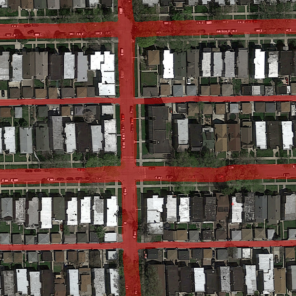
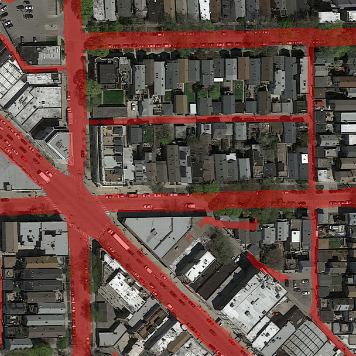
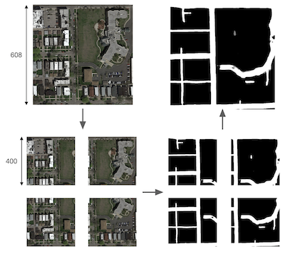

# Road Segmentation

<!-- ## On the empirical comparison between a data-augmented U-Net and a patch-wise CNN -->

## Introduction

<table>
    <tr>
        <td>
            
        </td>
        <td>
            
        </td>
    </tr>
</table>

In the context of the [EPFL Road Segmentation AICrowd challenge](https://www.aicrowd.com/challenges/epfl-ml-road-segmentation), our goal is to create a machine learning model that labels every 16x16 patches as either `road` or `background` on satellite images from GoogleMaps. The dataset is composed of 100 training images along with their respective grountruths and the 50-image test set whose predictions are to be submitted on AICrowd. 
For that, we trained a U-Net model that predicts each pixel's class as well as a Convolutional Neural Network trained to output a 2D-grid of labels: one for each patch of the image. In the end the U-Net, trained using heavy data augmentation, was more performant and is used for our final AICrowd submission ([#109366](https://www.aicrowd.com/challenges/epfl-ml-road-segmentation/submissions/109366)), reaching 90% of F1 score and 94.5% of accuracy.

### Team members
* Julien Benhaim
* Hugo Lepeytre
* Julien Vignoud 

## Table of contents

1. [Submission reproduction](#submission-reproduction)
2. [Folder architecture](#folder-architecture)
3. [Training pipeline](#training-pipeline)
    * [Data augmentation](#data-augmentation)
    * [Training](#training)
    * [Submission](#submission)

## Submission reproduction

First install the required libraries and packages used in this project:
```
pip install virtualenv
virtualenv venv
source venv/bin/activate
pip install -r requirements.txt
```
The setup is done and all is left is to create the predictions on the test set:
```
python run.py
```
It will load the model, run predictions on the test set and create a `.csv` containing a label for each patch.
The submission file is created in the top folder as `submission.csv`. Submitting this file on AICrowd yields an F1-score of 90%, identical to our submission [#109366](https://www.aicrowd.com/challenges/epfl-ml-road-segmentation/submissions/109366).

Once you are done, quit the virtual environnment with
```
deactivate
```

## Folder architecture

This folder contains several python modules, categorized as follows :
```
project
│   README.md
│   requirements.txt
|   run.py    
│
└───data
│   └───training
│   └───test_set_images
|   └───predictions
│   └───generated
|       └───flip
│       └───rotation
│       │   ...   
│   
└───helpers
|       colab.py
|       constants.py
|       file_manipulation.py
│        ...
|
└───model_save
|       final_model
|
└───notebooks
│       create_submission.ipynb
│       data_augmentation.ipynb
|       ...
|
└───assets
│       ...
```

Here are the main subfolders description:
<details open>
    <summary>data</summary>
    <br/>
    ajsdkskadjakd
</details>

<details>
    <summary>helpers</summary>
    <br>
    asdasda
</details>
<details>
    <summary>model_save</summary>
    <br>
    asdas
</details>

## Training pipeline

Here is described the pipeline used to train the model and fine tune the hyperparameters of our final model.

* [Data augmentation](#data-augmentation)
* [Training](#training)
* [Submission](#submission)

### Data augmentation
According to the paper that first described the U-Net architecture [[1]](https://arxiv.org/pdf/1505.04597.pdf), the performance depends heavily on data augmentation.  We chose to only perform the following transformations:
* rotation
* shift
* flip
* combination of the previous transformations

The script used to generate new data is illustrated in the `data_augmentation.ipynb` notebook, using the Tensorflow preprocessing class `ImageDataGenerator`. The generated images can be found in the `data/generated` folder.

### Training

Our models are defined in the `model` folder. The `pipeline.ipynb` notebook can be used to train a new model, using the Keras module of Tensorflow. The model used for our final submission has been trained using the data augmentated folders `hard_mix`, `rotation`, `mix` and `flip`, for a total of 900 images. The Adam optimizer was used along with the focal Tversky loss, defined in `helpers/loss_functions.py`, with $\alpha = 0.6$ and $\gamma = 0.75$. Both `EarlyStopping` and `ReduceLROnPlateau` callbacks were set on 250 epochs.

### Submission

Since our model is fitted for the size of the training images (400x400) we had to come up with a method to segment the test images, that have a size of 608x608. For that we chose the following method:
1. Split the image in 4 smaller images of size 400x400
2. Segment individually each image
3. Merge the 4 masks by averaging the overlapping parts
4. Binarize the outputs between 0 and 1 and assign a label to each patch, where a patch is labeled as road is the proportion of `road` pixel is greater than the threshold `ROAD_THRESHOLD_PATCH` defined in `helpers/constants.py`.

This process is implemented by the function `predict_submissions` defined in `helpers/submission.py` and illustred bellow:


